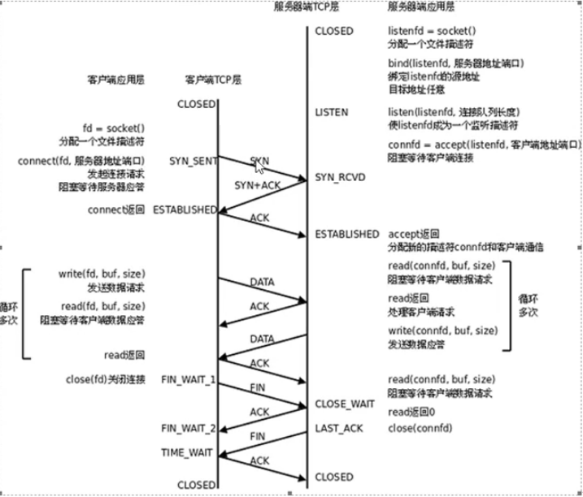

# 网络编程第二天笔记
## 一、TCP协议
### TCP协议的连接过程
---

**TCP报文首部格式**


**源端口和目的端口**: 各占两个字节，分别写入源端口号和目的端口号。序号 ： 占4个字节；用于对字节流进行编号，例如序号为 301，表示第一个字节的编号为 301，如果携带的数据长度为 100 字节，那么下一个报文段的序号应为 401。

**确认号** ： 占4个字节；期望收到的下一个报文段的序号。例如 B 正确收到 A 发送来的一个报文段，序号为 501，携带的数据长度为 200 字节，因此 B 期望下一个报文段的序号为 701，B 发送给 A 的确认报文段中确认号就为 701。

**数据偏移** ： 占4位；指的是数据部分距离报文段起始处的偏移量，实际上指的是首部的长度。

**确认 ACK** ： 当 ACK=1 时确认号字段有效，否则无效。TCP 规定，在连接建立后所有传送的报文段都必须把 ACK 置 1。

**同步 SYN** ：在连接建立时用来同步序号。当 SYN=1，ACK=0 时表示这是一个连接请求报文段。若对方同意建立连接，则响应报文中 SYN=1，ACK=1。

**终止 FIN** ： 用来释放一个连接，当 FIN=1 时，表示此报文段的发送方的数据已发送完毕，并要求释放连接。

**窗口** ： 占2字节；窗口值作为接收方让发送方设置其发送窗口的依据。之所以要有这个限制，是因为接收方的数据缓存空间是有限的
。
**检验和**： 占2个字节；检验和字段检验的范围包括首部和数据这两个部分。在计算检验和时，在TCP报文段的前面加上12字节的伪首部。

**套接字**： TCP连接的端点叫做套接字或插口。端口号拼接到IP地址即构成了套接字。


#### TCP的三次握手与四次挥手

1. 第一次握手：Client将标志位SYN置为1，随机产生一个值seq=x，并将该数据包发送给Server，Client进入SYN_SENT状态，等待Server确认。
2. 第二次握手：Server收到数据包后由标志位SYN=1知道Client请求建立连接，Server将标志位SYN和ACK都置为1，ack=x+1，随机产生一个值seq=y，并将该数据包发送给Client以确认连接请求，Server进入SYN_RCVD状态。
3. 第三次握手：Client收到确认后，检查ack是否为x+1，ACK是否为1，如果正确则将标志位ACK置为1，ack=y+1，并将该数据包发送给Server，Server检查ack是否为y+1，ACK是否为1，如果正确则连接建立成功，Client和Server进入ESTABLISHED状态，完成三次握手，随后Client与Server之间可以开始传输数据了。

>**为什么要进行三次握手呢？** 
第三次握手是为了防止失效的连接请求到达服器，让服务器错误打开连接。客户端发送的连接请求如果在网络中滞留，那么就会隔很长一段时间才能收到服务器端发回的连接确认。客户端等待一个超时重传时间之后，就会重新请求连接。但是这个滞留的连接请求最后还是会到达服务器，如果不进行三次握手，那么服务器就会打开两个连接。如果有第三次握手，客户端会忽略服务器之后发送的对滞留连接请求的连接确认，不进行第三次握手，因此就不会再次打开连接。
>
>__如果此时变成两次挥手行不行?__
举个打电话的例子，比如：第一次握手：A给B打电话说，你可以听到我说话吗？第二次握手：B收到了A的信息，然后对A说：我可以听得到你说话啊，你能听得到我说话吗？第三次握手：A收到了B的信息，然后说可以的，我要给你发信息啦！结论：在三次握手之后，A和B都能确定这么一件事：我能听到你，你也能听到我。这样，就可以开始正常通信了。如果是两次，那将无法确定。

#### 当数据传送完毕,断开连接就需要进行TCP的四次挥手：
---

1. 第一次挥手，客户端设置seq和 ACK ,向服务器发送一个 FIN(终结)报文段。此时，客户端进入 FIN_WAIT_1状态，表示客户端没有数据要发送给服务端了。
2. 第二次挥手，服务端收到了客户端发送的 FIN 报文段，向客户端回了一个 ACK 报文段。
3. 第三次挥手，服务端向客户端发送FIN 报文段，请求关闭连接，同时服务端进入 LAST_ACK 状态。
4. 第四次挥手，客户端收到服务端发送的 FIN 报文段后，向服务端发送 ACK 报文段,然后客户端进入 TIME_WAIT状态。服务端收到客户端的 ACK 报文段以后，就关闭连接。此时，客户端等待2MSL（指一个片段在网络中最大的存活时间）后依然没有收到回复，则说明服务端已经正常关闭，这样客户端就可以关闭连接了。

> **为什么要四次挥手呢？**
> 客户端发送了 FIN 连接释放报文之后，服务器收到了这个报文，就进入了 CLOSE-WAIT 状态。这个状态是为了让服务器端发送还未传送完毕的数据，传送完毕之后，服务器会发送 FIN 连接释放报文。


#### 滑动窗口

---
窗口是缓存的一部分，用来暂时存放字节流。发送方和接收方各有一个窗口，接收方通过 TCP 报文段中的窗口字段告诉发送方自己的窗口大小，发送方根据这个值和其它信息设置自己的窗口大小。

发送窗口内的字节都允许被发送，接收窗口内的字节都允许被接收。如果发送窗口左部的字节已经发送并且收到了确认，那么就将发送窗口向右滑动一定距离，直到左部第一个字节不是已发送并且已确认的状态；接收窗口的滑动类似，接收窗口左部字节已经发送确认并交付主机，就向右滑动接收窗口。

接收窗口只会对窗口内最后一个按序到达的字节进行确认，例如接收窗口已经收到的字节为 {31, 34, 35}，其中 {31} 按序到达，而 {34, 35} 就不是，因此只对字节 31 进行确认。发送方得到一个字节的确认之后，就知道这个字节之前的所有字节都已经被接收。


#### TCP 流量控制
---
流量控制是为了控制发送方发送速率，保证接收方来得及接收。

接收方发送的确认报文中的窗口字段可以用来控制发送方窗口大小，从而影响发送方的发送速率。将窗口字段设置为 0，则发送方不能发送数据。

#### 拥塞控制
----


#### TCP 协议得客户端/服务器程序的一般流程
---



 ## 高性能服务器

 ### 多进程并发服务器
 ---
 
 ```c
 //1. 创建socket 监听套接字lfd
 Socket(int domain, int type, int protocol);
 //2. 绑定监听套接字和IP地址 Strcut sockaddr_in servaddr;
 Bind(int sockfd, const struct sockaddr *myaddr, socklen_t addrlen);
 //3. 监听
 Listen(int sockfd, int backlog);
 //4. 创建子进程
 while (1)
 {
    cfg = Accpet(sockfd, (SA *) &cliaddr, &clilen);
    pid = fork();
    if (pid == 0)     //子进程read(cfd) --小》》大 
    {
        close (lfd);
        
        //小--大
        write();
    } else if (pid > 0)
    {
        close(cfd); //关闭用于与客户端通信得cfd
        continue;
    }
 }
 //5.子进程：
    close(lfd);
    read();
    //小--大
    write();
    父进程：
    close(cfd);
    注册信号捕获函数： SIGCHLD
    在回调函数中，完成子进程回收
    while (waitpid());
 ```

 ### 多线程并发服务器
 ---
 ```c
  //1. 创建socket 监听套接字lfd
 Socket(int domain, int type, int protocol);
 //2. 绑定监听套接字和IP地址 Strcut sockaddr_in servaddr;
 Bind(int sockfd, const struct sockaddr *myaddr, socklen_t addrlen);
 //3. 监听
 Listen(int sockfd, int backlog);
 //4. 
 while (1)
 {
    cfg = Accpet(sockfd, (SA *) &cliaddr, &clilen);
    pthread_create(&tid,NULL,tfn,NULL);
    pthread_detach(tid);
 }
 //5.子线程
 void tfn(void *arg)
{
    close(lfd);
    read(cfd);
    //小--大
    write(cfd);
    pthread_exit((void*)10);

}

 ```