#网络基础
##协议
是一组规则：TCP、UDP、HTTP等
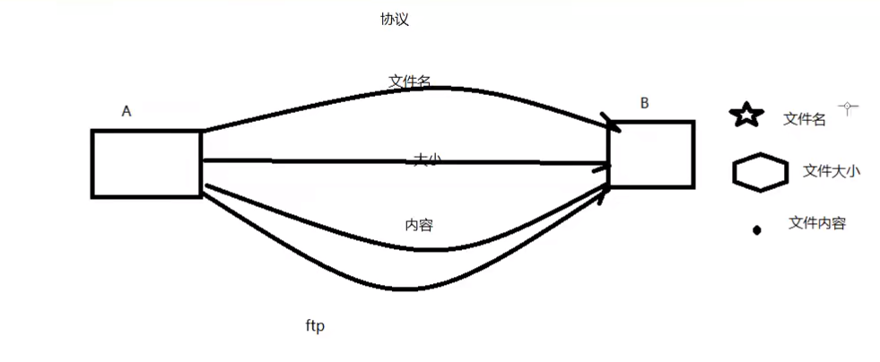
从应用的角度出发，协议可理解为“规则”，是数据传输和数据的解释的规则。
假设，A、B 双方欲传输文件。规定:

第一次，传输文件名，接收方接收到文件名，应答 OK 给传输方，
第二次，发送文件的尺寸，接收方接收到该数据再次应答一个 OK;
第三次，传输文件内容。同样，接收方接收数据完成后应答 OK 表示文件内容接收成功。

由此，无论 A、B之间传递何种文件，都是通过三次数据传输来完成。A、B之间形成了一个最简单的数据传输规则。双方都按此规则发送、接收数据。A、B 之间达成的这个相互遵守的规则即为协议。

这种仅在 A、B 之间被遵守的协议称之为**原始协议**。当此协议被更多的人采用，不断的增加、改进、维护、完善。最终形成一个稳定的、完整的文件传输协议，被广泛应用于各种文件传输过程中。该协议就成为一个**标准协议**。最早的ftp协议就是由此衍生而来。

TCP协议注重数据的传输。Http 协议着重于数据的解释。


## 典型协议

传输层常见协议有 TCP/UDP 协议。

应用层 常见的协议有 HTTP 协议，FTP 协议。

网络层 常见协议有IP 协议、ICMP 协议、IGMP 协议。

网络接口层 常见协议有ARP 协议、RARP 协议。

TCP 传输控制协议(Transmission Control Prorocol)是一种面向连接的、可靠的、基于字节流的传输层通信协议。

UDP 用户数据报协议(User Datagram Protocol)是 0SI 参考模型中一种无连接的传输层协议，提供面向事务的简单不可靠信息传送服务。

HTTP 超文本传输协议(Hyper Text Transfer Protocol)是互联网上应用最为广泛的一种网络协议。

FTP 文件传输协议 (File Transfer Protocol)

IP 协议是因特网互联协议 (Internet Protocol)

ICMP 协议是 Internet 控制报文协议(internet Control Message Protocol) 它是TCP/IP协议族的一个子协议，用于在IP 主机、路由器之间传递控制消息。

IGMP 协议是 Internet 组管理协议 (internet Group Management Protocol)，是因特网协议家族中的一个组播协议。该协议运行在主机和组播路由器之间。

ARP 协议是正向地址解析协议 (Address Resolution Protocol)，通过已知的IP，寻找对应主机的 MAC 地址。


RARP是反向地址转换协议，通过 MAC 地址确定IP 地址。

## 分层模型结构

OSI:物、数、网传、会、表、应 
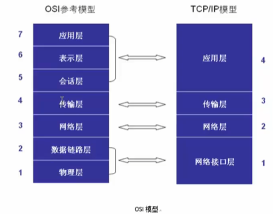
七层模型(Open System Interconnection Reference Model) 是一种概念模型，由国际标准化组织(ISO)提出，其目的是使各种计算机系统能够进行相互通信。

TCP/IP 4层模型：网（链路层/网络接口层）、网、传、应

**应用层**：http、ftp、nfs、ssh、telnet
**传输层**：TCP、UDP
**网络层**：IP、ICMP、IGMP
**数据链路层**：ARP、RARP、以太网协议
**物理层**：Ethernet、WiFi


### TCP/IP 协议族体系结构以及主要协议
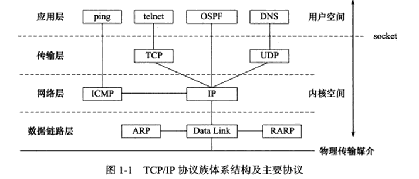
#### 数据链路层
网络层使用IP地址寻址一台机器，而数据链路层使用物理地址寻址一台机器，因此网络层必须先将目标机器的IP地址转化成其物理地址，才能使用数据链路层提供的服务，这就是ARP协议的用途

#### 网络层
网络层实现数据包的选路和转发。网络层对上层协议隐藏了网络拓扑连接的细节，使得在传输层和网络应用程序看来，通信的双发是直接相连的。

网络层最核心的协议是**IP协议(Internet Protocol,因特网协议)**。IP协议根据数据包的目的IP地址来决定如何投递它。如果数据包不能直接发送给目标主机，那么IP协议就为它寻找一个合适的下一跳(next hop)路由器，并将数据包交付给该路由器来转发。多次重复这一过程，数据包最终到达目标主机，或者由于发送失败而被丢弃。可见，**IP协议使用逐跳(hop by hop)的方式**确定通信路径。

网络层另外一个重要的协议是ICMP协议(Internet Control Message Protocol,因特网控制报文协议)。它是IP协议的重要补充，主要用于检测网络连接。ICMP协议使用的报文格式如图所示。

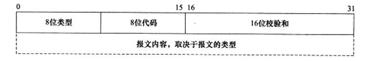

上图中，8位类型字段用于区分报文类型。它将ICMP报文分为两大类：一类是差错报文，这类报文主要用来回应网络错误，比如目标不可到达(类型值为3)和重定向(类型值为5);另一类是查询报文，这类报文用来查询网络信息，比如ping程序就是使用ICMP报文查看目标是否可到达(类型值为8)的。有的ICMP报文还使用8位代码字段来进一步细分不同的条件。比如重定向报文使用代码值0表示对网络重定向，代码值1表示对主机重定向。ICMP报文使用16位校验和字段来校验ICMP报文的正确性。
需要指出的是，ICMP报文并不是直接发送给应用层的，而是先发送给IP层，再由IP层转发给应用层。（一般来说，上层协议使用下层协议提供的服务）。

### 传输层

传输层为两台主机上的应用程序提供端到端(end to end)的通信。与网络层使用的逐跳通信方式不同，传输层只关心通信的起始端和目的端，而不在乎数据包的中转过程。下图展示了传输层和网络层的这种区别。
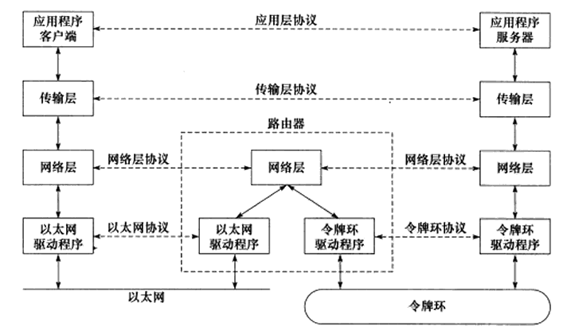

传输层协议主要有三个：TCP协议、UDP协议、和SCTP协议。
**TCP协议**(Transmission Control Protocol,传输控制协议)是传输层最主要的协议，它提供的是面向连接的、可靠的数据流服务。TCP协议提供超时重传机制，以保证传输的可靠性。TCP协议还提供流量控制和拥塞控制机制，以防止发送端发送速率过大导致接收端来不及处理而造成网络拥塞。

**UDP协议**(User Datagram Protocol,用户数据报协议)是另一个传输层协议，它提供的是无连接的、尽最大努力的数据传输服务。UDP协议不提供可靠的数据传输服务，也不提供超时重传机制。如果传输过程中出现丢包，UDP协议就直接丢弃该报文，而不重传。

**SCTP协议**(Stream Control Transmission Protocol)是一种传输协议，在TCP/IP协议栈中所处的位置和TCP、UDP类似，兼有TCP/UDP两者特征。

#### SCTP 与 TCP 的区别

和 TCP 类似，SCTP 是**面向连接、端到端、全双工、带有流量和拥塞控制的**可靠传输协议。数据可靠传输都是通过确认机制来实现的，与 TCP 的区别是：

1. TCP 是以字节为单位传输的，SCTP 是以数据块为单位传输的。
2. TCP 通常是单路径传输，SCTP 可以多路径传输。
3. TCP 的两端都只能用一个 IP 来建立连接，连接建立之后就只能用这一对 IP 来相互收发消息。如果这一对 IP 之间的路径出了问题，那这条 TCP 连接就不可用了；而 SCTP 的两端都可以绑定到多个 IP 上，只要有其中一对 IP 能通，这条 SCTP 连接就还可以用。这就是 SCTP 的多宿主机制。
4. TCP 是单流的有序传输，SCTP 可以多流独立有序/无序传输。这就是 SCTP 的多流机制。
5. TCP 连接的建立过程需要三步握手，SCTP 连接的建立过程需要四步握手。
6. SCTP 有 Heartbeat（心跳）机制来管理路径的可用性。


### 应用层
应用层负责处理应用程序的逻辑。数据链路层、网络层和传输层负责处理网络通信细节，这部分必须既稳定又高效，因此它们都在内核空间中实现，而应用层则在用户空间实现，因为它负责处理众多逻辑，比如文件传输、名称查询和网络管理等。如果应用层也在内核中实现，则会使内核变得非常庞大。当然，也有少数服务器程序是在内核中实现的，这样代码就无须在用户空间和内核空间来回切换(主要是数据的复制),极大地提高了工作效率。不过这种代码实现起来较复杂，不够灵活，且不便于移植。


### C/S 模型：
**client-sever**
### B/S 模型：
**brower-server**

|| C/S|B/S|
|---| --- | --- |
|优点|缓存大量数据、协议选择灵活、速度快|安全性高、跨平台、开发工作量小|
|缺点|安全性低、无法跨平台、开发工作量大|不能缓存大量数据、严格遵守Http|


## 网络通讯过程
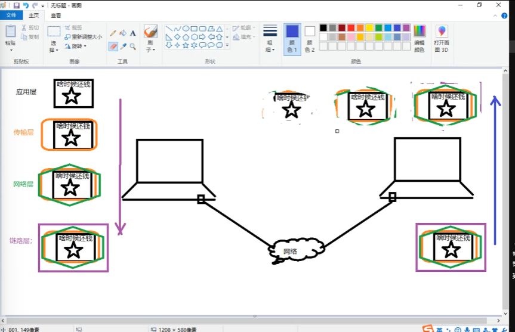

>数据没有封装，是无法在网络中进行传递的
数据-应用层-传输层-网络层-数据链路层-物理层

## 数据封装


### 以太网帧格式

以太网帧格式如下图：
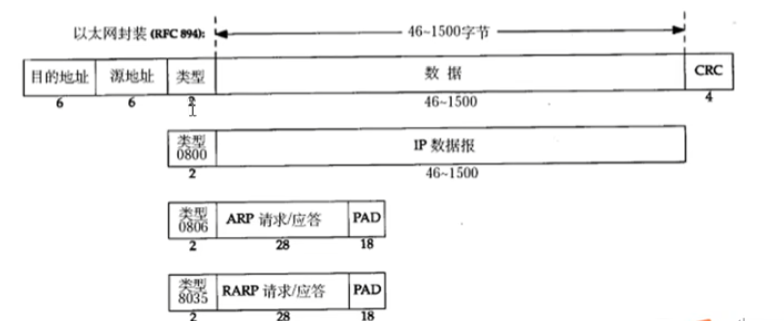
以太网帧协议：
ARP协议：地址解析协议，通过IP地址，寻找对应的MAC地址。
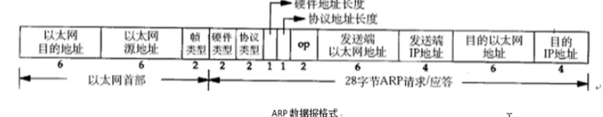
以太网帧协议：根据mac地址，完成数据包传输

### IP段格式
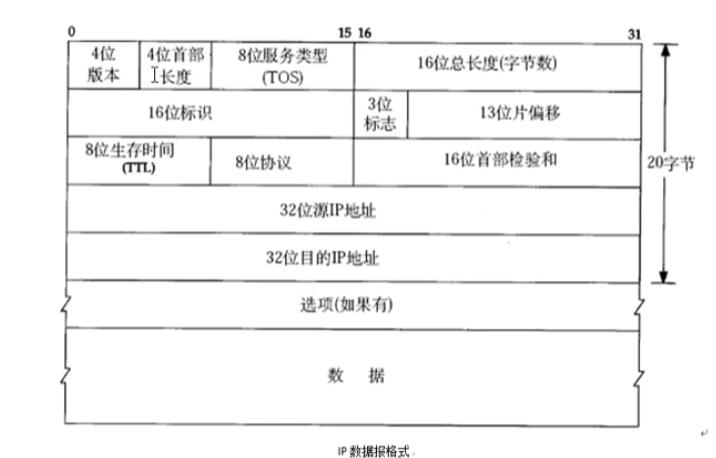
**TTL**：TIme To Live，生存时间，表示数据包在网络中的存活时间，每经过一个路由器，TTL值减1，当TTL值为0时，数据包被丢弃。

版本：IPV4、IPV6 --4字节
源IP：32位 --4字节  192.168.1.100 ---点分十进制 IP地址 （string） 二进制
目的IP：32位 --4字节

#### UDP段格式：

16位：源端口号  2^16 = 65336
16位：目的端口号


#### TCP数据报格式
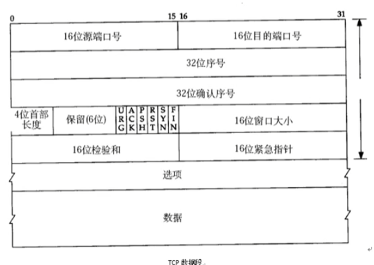

16位：源端口号  2^16 = 65336
16位：目的端口号
32位：序列号
32位：确认号
6个标志位
16位：窗口大小 2^16 = 65336

## 网络套接字
### 套接字概念
套接字是应用层与运输层之间的一个抽象层，它把复杂的运输层复杂的细节隐藏在套接字下面。

在通信过程中，套接字是成对存在的
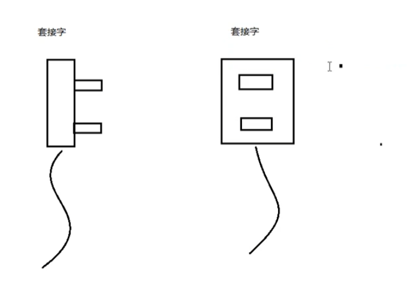

#### Linux套接字原理
一个文件描述符指向一个套接字（该套接字内部又内核借助两个缓冲区实现）
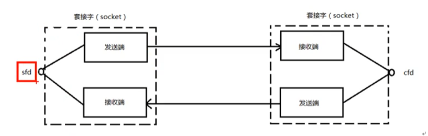


## 网络套接字函数
### 网络字节序

小端法：高位存高地址，低位存低地址 （机器）
大端法：高位存低地址，低位存高地址 （网络存储）
为使用网络程序具有可移植性，使同样的C代码在大端和小端计算机上编译后能正常运行，可以调用以下库函数做<font color=Red>网络字节序和主机字节序的转换</font>。
#### 网络字节序转换函数
```c
#include <arpa/inet.h>
uint32_t htonl(uint32_t hostlong);  --本地--》》网络（IP）
uint16_t htons(uint16_t hostshort); --本地--》》网络（端口）
uint32_t ntohl(uint32_t netlong);  --网络--》》本地（IP）   
uint16_t ntohs(uint16_t netshort); --网络--》》本地（端口）
``` 

#### IP地址转换函数
``` c
#include <arpa/inet.h>
int inet_pton(int af, const char *src, void *dst); 
//将点分十进制IP地址转换成网络字节序二进制IP地址
//af:地址类型， AF_INET IPv4
//src:点分十进制IP地址字符串        
//dst:存储二进制IP地址
//返回值：
//      成功:1
//      异常：0，说明src指向的不是一个有效的ip地址
//      失败：-1
const char*inet_ntop(int af, const void *src, char *dst, socklen_t size);
//将网络字节序二进制IP地址转换成点分十进制IP地址
//af:地址类型， AF_INET IPv4
//src:存储二进制IP地址
//dst:点分十进制IP地址字符串
//size:dst的大小
//返回值：
//      成功:指向dst字符串的指针
//      失败：NULL

``` 
### sockaddr数据结构
```c
struct sockaddr_in addr;
addr.sin_family = AF_INET;  //协议族
addr.sin_port = htons(80);  //端口号
addr.sin_addr.s_addr = inet_addr("192.168.1.100"); //IP地址
addr.sin_addr.s_addr = htonl(INADDR_ANY);  //INADDR_ANY表示0.0.0.0
bind(fd,struct sockaddr *)&addr ,size);
```

### socket模型图
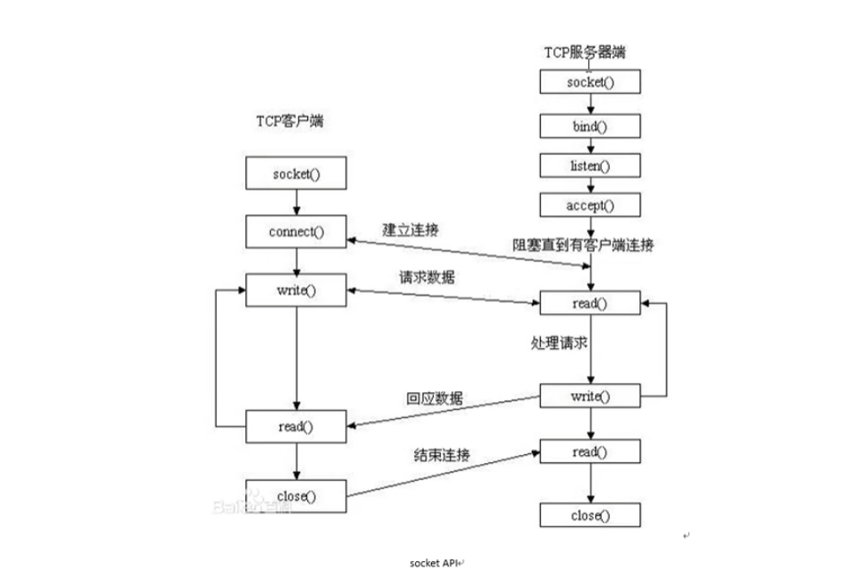


>bind()函数将一个地址族中的特定地址赋给socket，绑定IP地址和端口号，成功时返回0，失败时返回-1。
listen()函数将socket设为监听状态，设置监听上限(t同时)，成功时返回0，失败时返回-1。
accept()函数等待客户端连接，成功时返回一个新的socket，失败时返回-1。阻塞监听客户端连接
connect()函数用于客户端向服务器端发起连接，成功时返回0，失败时返回-1。
read()函数用于接收数据，成功时返回读入的数据长度，失败时返回-1。
write()函数用于发送数据，成功时返回写入的数据长度，失败时返回-1。
close()函数用于关闭socket，成功时返回0，失败时返回-1。

#### socket()函数
```c
#include<sys/socket.h>
int socket(int domain, int type, int protocol);

//domain:协议族 AF_INET4,AF_INET6、AF_UNIX
//type:socket类型，SOCK_STREAM、SOCK_DGRAM、SOCK_RAW、SOCK_SEQPACK
//procol:协议，IPPROTO_TCP、IPPROTO_UDP、IPPROTO_RAW、IPPROTO_ICMP

返回值：
    成功：新套接字所对应文件描述符
    失败：-1 error
int bind(int sockfd, const struct sockaddr *addr, socklen_t addrlen); //给sockfd绑定一个地址结构（IP + port）
    //sockfd:socket 函数返回值

struct sockaddr_in addr;
addr.sin_family = AF_INET;  //协议族
addr.sin_port = htons(80);  //端口号
addr.sin_addr.s_addr = htonl(INADDR_ANY);  //INADDR_ANY

    //addr：传入struct sockadd*(&addr)  
    //addrlen：sizeof(addr)地址结构大小
返回值
    成功：0
    失败：-1 error

int listen(int sockfd, int backlog); //设置同时与服务器建立连接的上限（同时进行3次握手的客户端数量），监听端口

    //sockfd:socket 函数返回值
    //backlog:同时与服务器建立连接的上限，最大值128
返回值
    成功：0
    失败：-1 error

int accept(int sockfd, struct sockaddr *addr, socklen_t *addrlen); //阻塞等待客户端连接，成功返回一个与客户端成功连接的socket文件描述符号

    //sockfd:socket 函数返回值      
    //addr：struct sockadd*(&addr),传出参数，成功与服务器连接的那个客户端的地址结构（IP+port）
    socklen clit_addr_len; = sizeof(addr);
     
    //addrlen：sizeof(addr)地址结构大小，传入传出，入：addr的大小，出：客户端addr实际大小,&clit_addr_len。
返回值
    能与服务器建立连接的客户端的socket文件描述符
    失败：-1 error

int connect(int sockfd, const struct sockaddr *addr, socklen_t addrlen); //连接服务器

    //sockfd:socket 函数返回值
    //addr：传入参数：struct sockadd*(&addr),服务器的地址结构（IP+port）
    //addrlen：服务器的地址结构 sizeof(addr)地址结构大小 

返回值
    成功：0
    失败：-1 error

//如果不使用bind绑定客户端地址结构，采用"隐式绑定"。

```

#### TCP通信流程分析
**server**:
1. socket()  -> 创建socket文件描述符
2. bind()    -> 绑定客户端地址结构
3. listen()  -> 监听端口,设置监听上限
4. accept()  -> 阻塞等待客户端连接，成功返回一个与客户端成功连接的socket文件描述符
5. read()    -> 读取客户端数据
6. write()   -> 向客户端写数据
7. close()   -> 关闭socket文件描述符
   
**client**:
1. socket()  -> 创建socket文件描述符
2. connect() -> 连接服务器
3. write()   -> 向服务器写数据
4. read()    -> 读取服务器数据
5. close()   -> 关闭socket文件描述符

